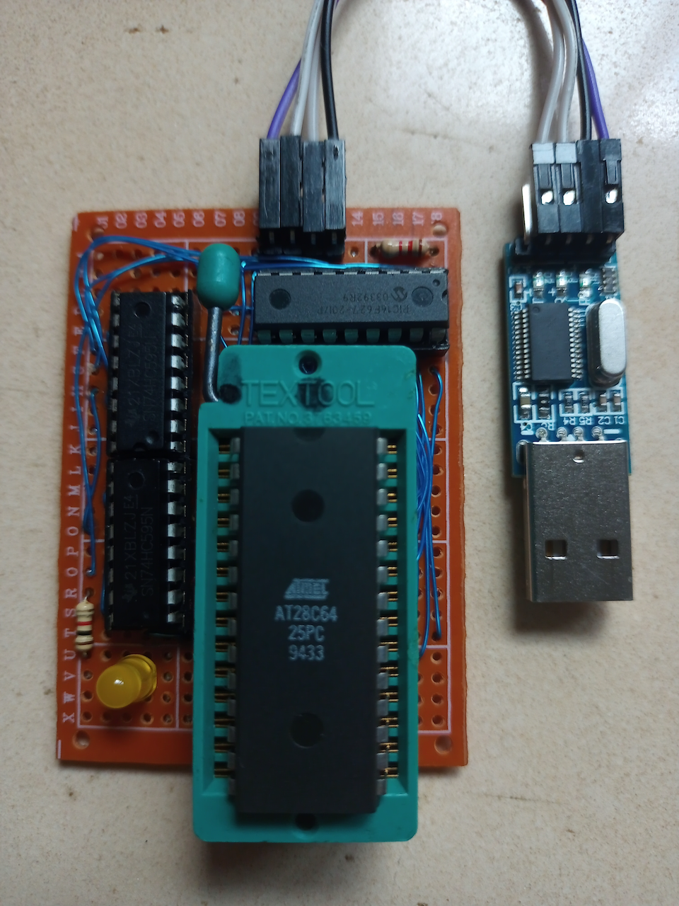
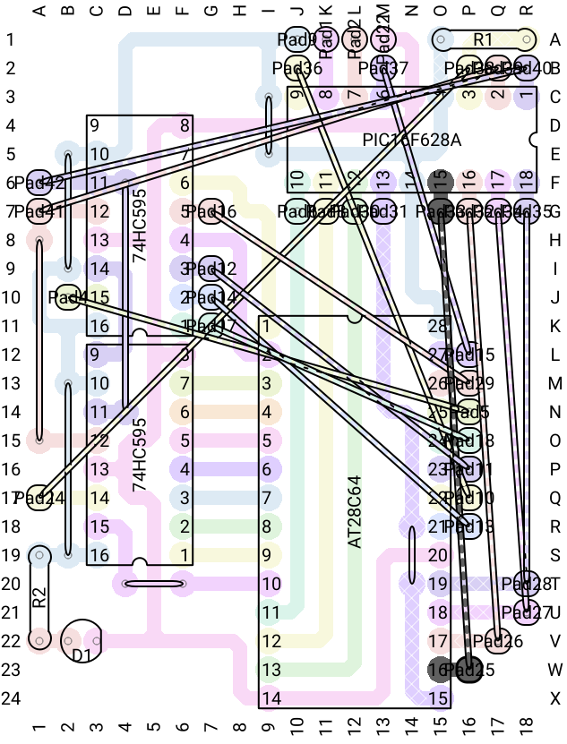

The original sources can be found here: https://github.com/gmcgarry/eeprog

# eeprog

Basic programmer for AT28C64 EEPROMs using two 74HC595 and PIC16F627.

Connect a common UART-to-TTL adapter to the programming header.

It currently supports the following features:

- hex dump
- erase all
- write hex line
- unlock AT28C256 SDP
- toggle between fast erase (AT28C64) or slow erase (CAT28C256)

In the future:

- page writes for CAT27C256

## Software

The programmer communicates with the host system over UART.  The
UART must be configured for 19200,N81.  Here's a quick way to connect:

	$ screen /dev/ttyUSB 19200

The following commands are supported:

| key | command |
| --- | --- |
| 'H' | help information |
| 'D' | dump memory between 0x0000 and 0x8000 |
| 'E' | erase memory ebtween 0x000 and 0x8000 |
| ':' | parse line as ihex line and write memory |
| 'F' | toggle fast erase (1ms) vs (5ms) |
| 'U' | unlock SDP on CAT28C256 EEPROMs |

With these commands, an EEPROM can be programmed by cut-and-pasting a
.ihex file into the terminal program.

## Hardware

The hardware consists of a PIC16F627 for communication with the host system,
and two 74HC595 serial-to-parallel shift registers.  The shift registers
latch the 16-bit address on the address bus.  The data bus is connected
directly to the PIC16F627.

Any compatible PIC with a UART can be used.  There's no reason a PIC16F84
couldn't be used with UART bit-banging since communications is mostly
half-duplex (except fo interrupting the hex dump).

The pin arrangement on the PIC is more complex than initially intended due
to the shared role of some of the pins.

| pin | name | function |
| --- | --- | --- |
| 1 | RA2 | address clock (SHCLK) |
| 2 | RA3 | address latch (SHLAT) |
| 3 | RA4 | address data (SHDAT) |
| 4 | /MCLR | /RESET |
| 5 | GND | GND |
| 6 | RB0 | /WE |
| 7 | RB1 | RX |
| 8 | RB2 | TX |
| 9 | RB3 | /OE |
| 10| RB4 | D0 |
| 11| RB5 | D1 |
| 12| RB6 | D2 |
| 13| RB8 | D3 |
| 14| VCC | 5V |
| 15| RA6 | D4 |
| 16| RA7 | D5 |
| 17| RA0 | D6 |
| 18| RA1 | D7 |

The UART pins sit in the middle of PORTB and the /MCLR pin
on PORTA is input only.  Consequently, the data bus is driven by the
top nibble of PORTB and pins RA0,RA1,RA6,RA7 on PORTA.  The nice result is
that the data bus connects to the pins on right side of the PIC.

~~~~
         +---v---+
  SHCLK -| *     |- D7
  SHLAT -|       |- D6
  SHDAT -|       |- D5
  RESET -|       |- D4
    GND -|       |- 5V
    /WE -|       |- D3
     RX -|       |- D2
     TX -|       |- D1
    /OE -|       |- D0
         +-------+
~~~~

I challenge myself to construct these projects on 5x7cm veroboard.  I recommend
the excellent [VeroRoute](https://sourceforge.net/projects/veroroute/)
for quickly optimising component locations in veroboard designs.

Here's the layout exported from VeroRoute.

